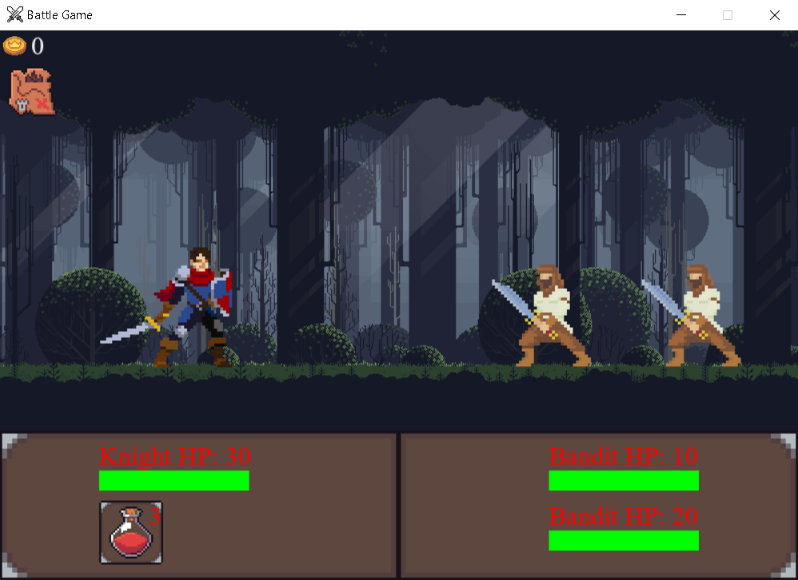

# ⚔️ RPG Game 🛡️

Repositório para criar um jogo de RPG de batalhas de turno.

Código base: [video](https://www.youtube.com/watch?v=Vlolidaoiak&list=PLjcN1EyupaQnvpv61iriF8Ax9dKra-MhZ) por Coding With Russ

# Planos
- Dividir o codigo em módulos
- Menu principal
    - Melhorar o Menu
- Adicionar escolha de heroi
    - Adicionar opção de escolha no menu
    - Varias moedas, poções e força de cada heroi
- Adicionar mais inimigos
- Organizar o codigo
- Melhorar a logica das moedas
- Melhorar a logica de reset
- Espaço invisivel das sprites do esqueleto muito grande(hitbox grande)
- Resetar o turno quando mudar de mapa
- Manter as poções compradas ao resetar
- Identificar o turno

# Feito
- Adicionar npcs
    - Ferreiro
        - Melhorar força
    - Comerciante
        - Comprar poções
    - Cachorro
    - Mendingo
 - Codigo base
 - Adicionar moedas
 - Opção de ir para a cidade
 - Arrumar o cursor
 - Mapa funcionando
 - Adicionar menu
 - Adicionar escolha de heroi