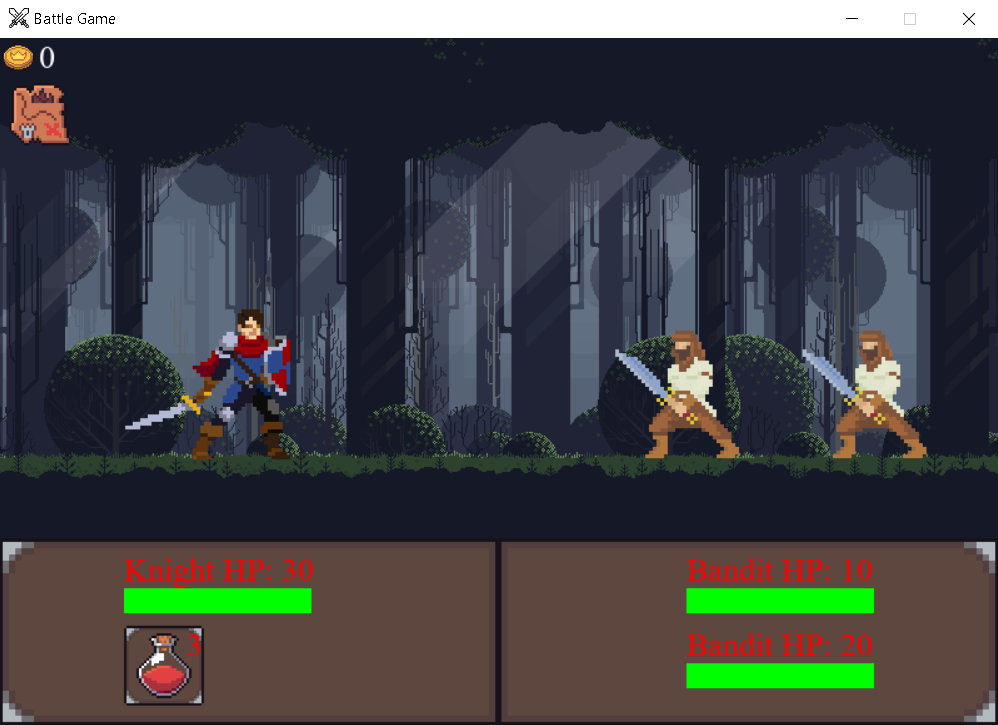

# ⚔️ RPG Game 🛡️

Repositório para criar um jogo de RPG de batalhas de turno.

Código base: [video](https://www.youtube.com/watch?v=Vlolidaoiak&list=PLjcN1EyupaQnvpv61iriF8Ax9dKra-MhZ) por Coding With Russ

# Planos
- [🔴] Melhorar Loops
- [🔴] Organizar o codigo
    - Dividir o codigo em módulos
- [🔴] 
- [🟡] Colocar a barra de vida junto da instancia de inimigo
- [🟡] Adicionar randomização de inimigos
- [🟡] Melhorar a logica de reset
- [🟡] Identificar o turno
- [🟢] Menu principal
    - Melhorar o Menu
- [🟢] Variar moedas, poções e força de cada heroi
- [🟢] Melhorar a logica das moedas
- [🟢] Adicionar Taverna/Guilda(na porta ao lado do mercador)
- [🟢] Adicionar nivel
- [🟢] Adicionar opção de aumentar vida
- [🟢] Randomizar status dos inimigos baseado no heroi

# Feito
- Adicionar npcs
    - Ferreiro
        - Melhorar força
    - Comerciante
        - Comprar poções
    - Cachorro
    - Mendingo
- Codigo base
- Adicionar moedas
- Opção de ir para a cidade
- Arrumar o cursor
- Mapa funcionando
- Adicionar menu
- Adicionar escolha de heroi
    - Adicionar opção de escolha no menu    
- Organizar ordem dos sprites
- Adicionar uma hitbox
- Manter as poções compradas ao resetar
- Adicionar mais inimigos
- Tirar mapa da batalha
    - Colocar opção de fugir(ir para a cidade e resetar a batalha)
- Arrumar animação de morte